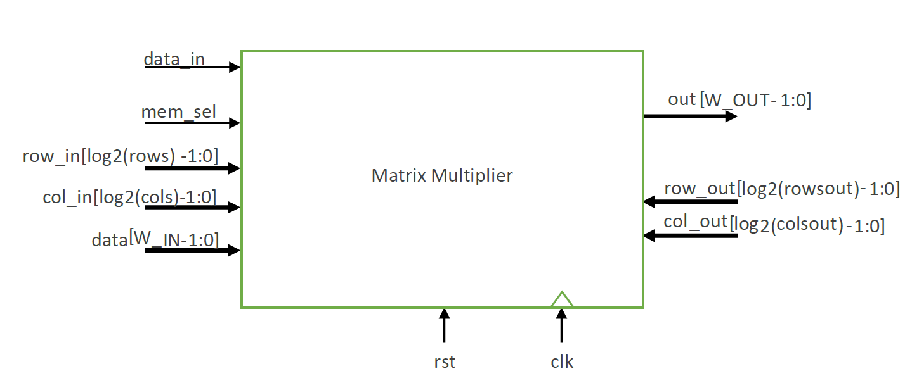

# Matrix-Multiplier_verilog_FPGA

In this project, we describe and test a matrix multiplier using Verilog. The schematic diagram of this multiplier is shown in the figure below.

Module specs:
    - Spatan6 chip xc6slx9
    - Package TQG144
    - Speed 3
    - The clock frequency is default.

Also, using Xpower Analyzer the power usage of the circuit has estimated.